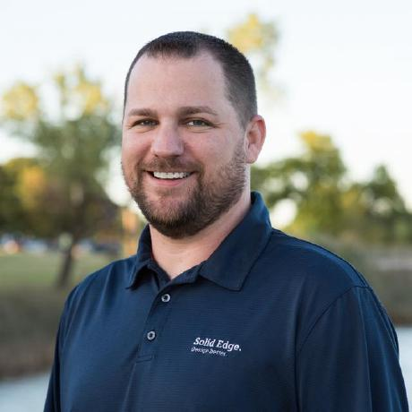

Title: About
---

Jason is an Applications Architect for <a href="http://charlesmachine.works/" target="_blank">Charles Machine Works</a> in Perry, Oklahoma, best known for its <a href="https://www.ditchwitch.com/" target="_blank">Ditch Witch</a> product line. A 20 year information technology veteran, Jason is well versed in a broad range of software technologies and programming languages. In 2005, Jason started JasonNewell.NET, a website dedicated to expanding the Solid Edge developer community and offering consulting services. Through his website, he was able to acquire Siemens PLM Solution Partner status and soon began consulting for Siemens PLM directly. Through his consulting efforts with Siemens PLM, Jason takes a leading role in expanding the developer community by contributing to the Solid Edge Software Development Kit (SDK), authoring open source projects and speaking at conferences.